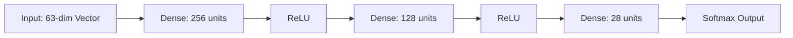
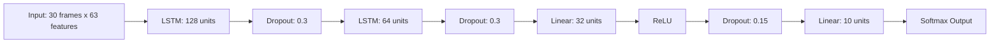
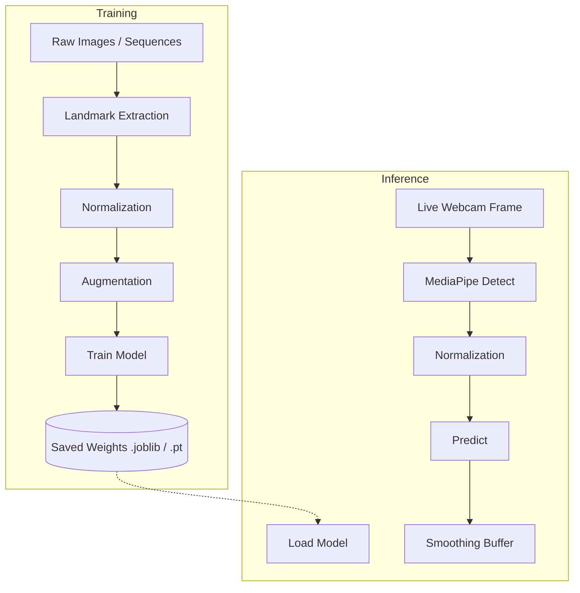

# Architecture Diagrams

## 1. End-to-End Pipeline

```mermaid
graph TD
    A[Webcam] -->|RGB Frame| B(OpenCV)
    B -->|Pre-processed Frame| C(MediaPipe Hands)
    C -->|21 Joint Landmarks| D[Normalization]
    D -->|63-dim Vector| E{Gesture Type}
    
    E -->|Static (Letter)| F(MLP Classifier)
    E -->|Dynamic (Sequence)| G(LSTM Classifier)
    
    F -->|Class + Confidence| H[Word Builder]
    G -->|Gesture + Confidence| I[Gesture Banner]
    
    H -->|Majority Vote| J[Hold-to-Confirm]
    J -->|Confirmed Letter| K[Word Buffer]
    
    K -->|Display| L[HUD overlay]
    K -->|Text-to-Speech| M[pyttsx3 / Web Speech]
    I -->|Display & Speak| M
```

## 2. MLP Architecture (Static Letters)



## 3. LSTM Architecture (Dynamic Gestures)



## 4. Data Flow (Training vs Inference)


